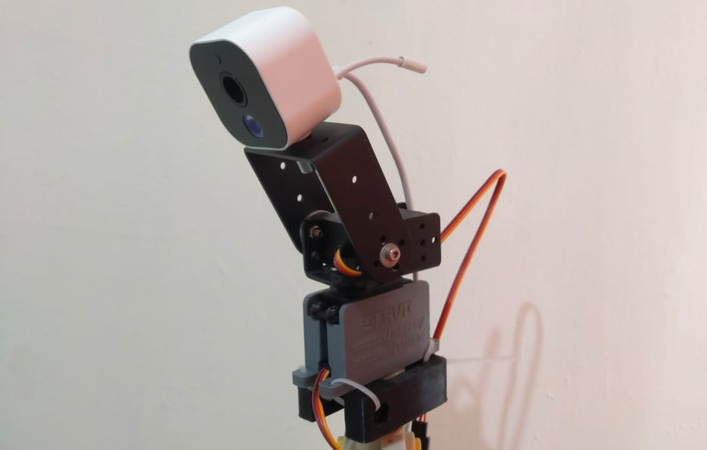

# Simple 2 D.O.F Camera Monitor
Very simple 2 D.O.F camera monitor robot with two servo motors. 
This is my first project to use Rust + embassy-rs for microcontroller.

    

## Project Structure
Please change to branch `pio_pwm` to see the servo motor with PIO PWM driver. The GPIO is the same for both PIO and PWM Driver version.

In this reposiroty we have two project: `robotic-arm-rp2040` for the robot code and `remote-control` for the remote control code.

<table>
  <tr> 
    <th width = 250px> robotic-arm-rp2040 </th>
    <th width = 250px> remote-control </th>
  </tr>
  <tr> 
    <td class="top-aligned" align="left"> 
<code style="vertical-align:top">.
├── Cargo.toml
├── build.rs
├── memory.x
└── src
    ├── main.rs
    ├── resources
    │   ├── gpio_list.rs
    │   └── mod.rs
    └── tasks
        ├── button.rs
        ├── mod.rs
        ├── servo_pio.rs
        └── uart_task.rs  
 
4 directories, 11 files
</code>
    </td> 
    <td style="vertical-align:top" align="left"> 
<code class = "language-bash">.
├── Cargo.toml
├── build.rs
├── memory.x
└── src
    ├── main.rs
    ├── resources
    │   ├── gpio_list.rs
    │   └── mod.rs
    └── tasks
        ├── button.rs
        ├── control_task.rs
        ├── display.rs
        └── mod.rs
 
4 directories, 12 files </code>
    </td>
  </tr>
</table>

## Getting Started

